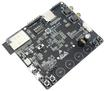
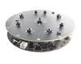

# Play mp3 file from HTTP

*现在这个例程默认使用M5Stack的NODE底座里面的WM8978音频芯片*
*例程现象： 需要配置NODE要连接的热点账号和密码，然后会播放几秒音频。*
*注意： 现在配置文件sdkconfig里面的热点账号和密码是"M5", "12345678"*

The demo plays a MP3 downloaded from HTTP. 

## Compatibility

| ESP32-LyraT | ESP32-LyraT-MSC |
|:-----------:|:---------------:|
|  |  |
|  |  |

## Usage

Prepare the audio board:

- Connect speakers or headphones to the board.

Configure the example:

- Select compatible audio board in `menuconfig` > `Audio HAL`.
- Set up the Wi-Fi connection by running `menuconfig` > `Example Configuration` and filling in `WiFi SSID` and `WiFi Password`.

Load and run the example:

- The audio board will first connect to the Wi-Fi.
- Then the board will start playing automatically.